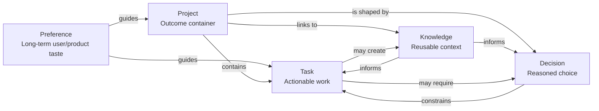
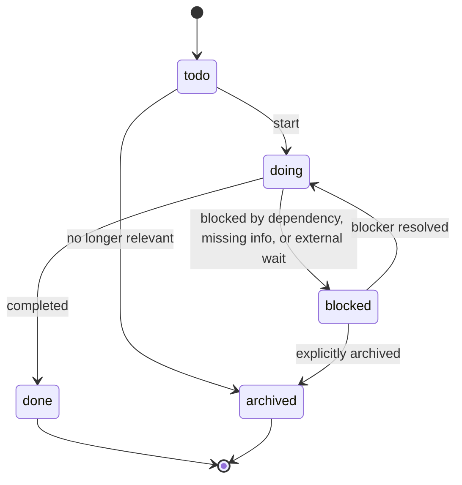
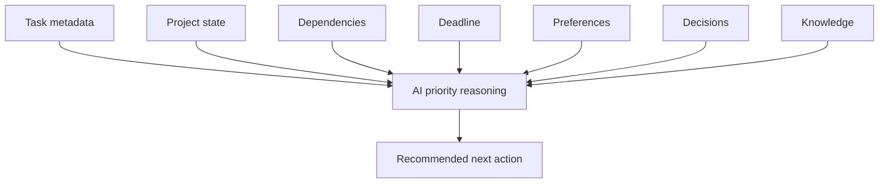

# AI Task System Architecture

## Purpose

This document defines the core information architecture for an AI task management system backed by Obsidian Markdown.

The goal is to make tasks understandable to both humans and AI agents. The system should help AI judge what matters, what is urgent, what is blocked, what depends on what, and what should happen next.

The GitHub repository for this product is `egawa-itax25/ai-work-os`.

Mobile review should use a Vercel deployment connected to the GitHub
repository. Local LAN URLs are acceptable for quick checks, but Vercel is the
preferred path when the user wants to inspect the product from a phone without
depending on the PC and phone being on the same Wi-Fi.

The cockpit is primarily operated on PC. Mobile access is a review and light
navigation surface, so the application should automatically choose a mobile
layout that avoids desktop absolute-positioned panels overlapping the viewport.

## Core Concepts

### Task

A Task is an actionable unit of work.

A task should describe a concrete outcome, carry enough context to be executed, and expose enough metadata for AI to prioritize it. A task is not deleted; it changes state over time.

A good task answers:

- What needs to be done?
- Why does it matter?
- What project does it belong to?
- What is blocking it?
- What does it depend on?
- How urgent and important is it?
- How much effort and energy does it require?
- When should it be completed?

### Project

A Project is a container for related tasks, decisions, knowledge, and progress toward an outcome.

A project represents a durable initiative rather than a single action. It preserves state, roadmap, version, TODOs, and blockers. Projects help AI understand broader context before ranking individual tasks.

A project should answer:

- What outcome are we trying to create?
- What is the current state?
- What version or phase are we in?
- What work remains?
- What is blocking progress?
- Which decisions and knowledge notes shape this project?

### Project Editable Fields

Project data should support in-context creation and editing from Portfolio View.

Recommended project fields:

| Field | Type | Purpose |
| --- | --- | --- |
| `id` | string | Stable identifier for UI, Vault sync, and links. |
| `name` | string | Human-readable project name. |
| `objective` | string | Why the project exists and what outcome it creates. |
| `owner` | string | Responsible person or agent. |
| `dueDate` | date or `monthly` | Target deadline. Use `monthly` for recurring monthly project work. |
| `progress` | number | Completion percentage from 0 to 100. |
| `currentBallHolder` | string | Person, customer, team, or AI currently holding the ball. |
| `ballHolderType` | enum | `self`, `customer`, `member`, `ai`, or `none`. |
| `ballHoldingDays` | number | How long the ball has been held. |
| `nextMilestone` | string | Next meaningful progress marker. |
| `aiSuggestion` | string | Short AI insight when useful. |
| `risk` | string | Risk text only when there is a meaningful risk. |

`owner` and `currentBallHolder` must remain separate. A user can own a project
while the current ball sits with a customer, another member, or AI.

### Knowledge

Knowledge is reusable context.

Knowledge notes preserve facts, lessons, causes, solutions, API details, library behavior, environment setup, bugs, and other reusable learning. Knowledge is not necessarily a decision or a task; it is material that can improve future reasoning.

Knowledge should answer:

- What was learned?
- When does it apply?
- What problem does it prevent or solve?
- Which projects, decisions, or tasks does it relate to?

### Decision

A Decision is a durable explanation of a choice.

Decisions preserve design judgments, technology selections, UI direction, database design, naming rationale, and other choices that future agents should not rediscover from scratch. Every decision must include a reason.

A decision should answer:

- What context led to this choice?
- What was decided?
- Why was it decided?
- What are the consequences?
- What would cause this decision to be revisited?

### Preference

A Preference is a long-term user or product tendency.

Preferences guide future behavior and design choices. They should not store temporary instructions or one-off constraints. Preferences help AI adapt decisions to the user's durable taste and working style.

A preference should answer:

- What long-term preference should be remembered?
- Where does it apply?
- How strongly should it influence future work?
- When should it be revised?

## Concept Relationships



## Task Lifecycle

Tasks are never deleted. They move through state while preserving history and context.



## Task Data Model

The task model should work as Markdown frontmatter first and application data second. The application can later parse Obsidian task notes into this structure.

### Required Frontmatter

All Vault notes must include these shared fields:

```yaml
date: YYYY-MM-DD
tags: []
project:
related: []
```

### Task Frontmatter

```yaml
---
date: 2026-07-06
tags: [ui, architecture]
project: ai-task-system
related:
  - Projects/AI-Task-System-Architecture.md

type: task
id: task-2026-07-06-example
status: todo
priority: medium
importance: 3
urgency: 3
estimate: 2h
energy: medium
deadline: 2026-07-10
depends: []
owner:
currentBallHolder:
ballHoldingStartedAt:
progress:
nextAction:
area:
source:
created: 2026-07-06
updated: 2026-07-06
---
```

### Field Definitions

| Field | Type | Purpose |
| --- | --- | --- |
| `type` | string | Identifies the note as a task. |
| `id` | string | Stable task identifier for links, dependencies, and future sync. |
| `title` | heading | Human-readable task name, stored as the Markdown H1. |
| `status` | enum | Current lifecycle state. |
| `priority` | enum | Human or AI assigned priority label. |
| `importance` | number | Strategic value, independent of urgency. |
| `urgency` | number | Time pressure or need for immediate attention. |
| `estimate` | string | Expected effort, such as `30m`, `2h`, or `1d`. |
| `energy` | enum | Cognitive/creative load needed: `low`, `medium`, `high`. |
| `deadline` | date | Target completion date. |
| `depends` | list | Task IDs or note links that must be resolved first. |
| `project` | string | Owning project key. |
| `tags` | list | Search, grouping, and AI context hints. |
| `related` | list | Linked notes, decisions, knowledge, or projects. |
| `owner` | string | Person or agent responsible. |
| `currentBallHolder` | string | Current person, team, customer, or AI that must act next. |
| `ballHoldingStartedAt` | date | When the current ball holder started holding the ball. |
| `progress` | number | Task progress from 0 to 100. |
| `nextAction` | string | The next concrete action needed to move the task. |
| `area` | string | Optional product or work area. |
| `source` | string | Origin of the task, such as user, AI, meeting, bug, or decision. |
| `created` | date | Creation date. |
| `updated` | date | Last meaningful update. |

### Status Values

| Status | Meaning |
| --- | --- |
| `todo` | Ready or waiting to be started. |
| `doing` | Currently active. |
| `blocked` | Cannot progress until a dependency or condition is resolved. |
| `done` | Completed. This is the normal completion state. |
| `archived` | Preserved but no longer active. Use only when explicitly appropriate. |

### Priority Values

| Priority | Meaning |
| --- | --- |
| `high` | Should be considered before most other work. |
| `medium` | Normal priority. |
| `low` | Useful but not pressing. |

### Importance And Urgency

`importance` and `urgency` should be numeric so AI can compare tasks.

Recommended scale:

- `1`: very low
- `2`: low
- `3`: medium
- `4`: high
- `5`: critical

Importance answers: "How much does this matter?"

Urgency answers: "How soon does this need attention?"

These should remain separate. A task can be important but not urgent, or urgent but not important.

### Energy Values

| Energy | Meaning |
| --- | --- |
| `low` | Mechanical or simple work. |
| `medium` | Normal implementation, planning, or writing work. |
| `high` | Deep design, architecture, debugging, or creative work. |

Energy helps AI recommend tasks based on available focus.

## AI Prioritization Model

AI should not rely on one field alone. It should calculate or reason from multiple dimensions.

Suggested prioritization inputs:

- Status
- Importance
- Urgency
- Deadline proximity
- Dependency readiness
- Project state
- Blockers
- Estimated effort
- Required energy
- User preferences
- Related decisions
- Related knowledge



### Suggested Priority Reasoning

AI should first filter tasks:

1. Exclude `done`.
2. Deprioritize `archived`.
3. Separate `blocked` unless the next action is to resolve the blocker.
4. Prefer tasks whose dependencies are complete or absent.

Then rank remaining tasks using:

```text
priority_signal =
  importance
  + urgency
  + deadline_pressure
  + project_relevance
  - dependency_penalty
  - energy_mismatch
```

This formula is a reasoning guide, not a fixed implementation requirement. The system should expose enough data for AI to explain why it recommends a task.

## Markdown Body Template

Task notes should use frontmatter for structured fields and Markdown body for human-readable context.

```markdown
# Task Title

## Outcome

What should be true when this task is done.

## Context

Why this task exists and what the AI should know before acting.

## Acceptance Criteria

- [ ] Concrete condition
- [ ] Concrete condition

## Blockers

- None

## Notes

Additional implementation or product notes.
```

## Open Design Questions

- Should AI-calculated priority be stored as a field, or recomputed each session?
- Should dependency links use task IDs, Obsidian links, or both?
- Should `estimate` become numeric minutes internally while staying human-readable in Markdown?
- Should completed tasks preserve completion date as `completed:`?
- How should recurring tasks be represented?

## Initial Direction

Use Markdown as the authoritative storage format, then derive UI state from parsed notes.

The first implementation can use dummy typed data, but the shape should remain compatible with Obsidian frontmatter and body sections.

## Vault Update Events

Vault maintenance is event-driven. When a project event occurs, the mapped Vault targets must be updated.

| Event | Required Vault Updates |
| --- | --- |
| Design change | `Decisions/` + `Projects/` |
| New feature added | `Projects/` |
| Bug resolved | `Knowledge/` + `Projects/` |
| Technology selection | `Decisions/` + `Knowledge/` + `Projects/` |
| Task added | `Tasks/` + `Projects/` |
| Task completed | `Tasks/` + `Projects/` |
| User setting changed | `Preferences/` |
| AI improvement from correction | `Knowledge/mistakes.md` |

The UI remains a view of Vault state. Task and project events must update the corresponding Vault notes, not only application state.

## Current UI Direction

The cockpit is evolving into an AI Work OS spatial canvas. Tasks should read as glowing planets, projects as star systems, and dependencies as gravity or orbit-like flow instead of ordinary cards and arrows.

Portfolio View is the upper layer above Project Flow. It compares multiple
projects with a calmer business UI before the user enters a single project's
spatial task Flow.

The navigation hierarchy is:

```text
Portfolio View
Project Inspector
Project Flow
Task Inspector
Knowledge
```

Portfolio View should also be the operation hub for creating and editing
projects and tasks without leaving the comparison context.

The first implementation may still use typed dummy records, but the interaction model should favor:

- A full-screen dark canvas with ambient stars and aurora-like depth.
- Top-centered Flow Score and work health summary.
- Left cockpit navigation.
- Right task inspection panel for AI focus and Vault metadata.
- Bottom future timeline for predicted bottlenecks.
- Smooth hover, drag, pulse, and flow animations.

Related decision: [[2026-07-06-ai-work-os-spatial-canvas]].
Japanese UI polish decision: [[2026-07-06-japanese-spatial-canvas-polish]].

## Implemented Features

- Top cockpit now presents a spatial AI Work OS surface with Flow Score, task planets, project orbit rings, gravity-like dependency flow, AI Focus inspection, related Vault notes, and a future timeline.
- Left navigation uses Cockpit, My Tasks, Inbox, Projects, Knowledge, Calendar, Analytics, AI, and Settings language to match the OS concept.
- The visible product UI has been localized for Japanese users across the cockpit and primary task/project/knowledge/settings pages.
- The cockpit now supports canvas pan, smooth zoom, draggable task planets, animated flow paths, pulsing important/stalled nodes, and a smooth AI analysis panel.
- Canvas pan and node drag should batch pointer updates to animation frames so
  the empty canvas follows the cursor without visible delay.
- The home cockpit should occupy the full viewport and carry its own in-canvas navigation, layer controls, minimap, AI message, command bar, and timeline.
- The cockpit should keep a compact navigation surface visible even when the
  standard app shell is hidden, so users can move to Portfolio, Tasks,
  Knowledge, and Settings.
- On desktop, the cockpit should also preserve the shared side navigation by
  default. The user can hide it for a more immersive canvas and restore it with
  a compact Japanese menu control.
- Next.js development indicators are disabled so English framework overlays do not appear during product review.
- Portfolio View is specified as a multi-project overview for progress,
  priority, current ball holder, stalled state, and user-actionable filtering.
- Portfolio View is implemented at `/portfolio` with URL filters, compact
  project nodes, Priority Score breakdown, and links into existing Project Flow
  routes.
- Portfolio View should support in-context project creation/editing and task
  creation through drawers and a shared Project Inspector.
- Editable project, task, trash, and completed-work state should synchronize
  through Supabase for logged-in users. Browser localStorage remains a fast
  cache and unauthenticated fallback, but it is no longer the intended durable
  source for cross-device work state.
- Cross-device work requires the same Supabase Auth login. The sync layer keeps
  local cache timestamps, compares them with Supabase `updated_at`, and stores
  a small local backup before replacing cached workspace state so PC-entered
  projects and tasks are not silently lost during device or deployment changes.
- Supabase sign-up must guide users through required email confirmation in
  Japanese. The login screen provides confirmation-email resend, and the auth
  callback establishes the session before returning to Portfolio View.
- Initial typed fallback data must not be automatically uploaded as workspace
  state. Project and task arrays should merge local-only records into the
  remote state by `id` so earlier PC-entered work is preserved when sync is
  enabled after local use.
- Project Flow should support Task Inspector editing on node selection.
- Project Flow should support drag-to-transfer for task ball ownership, using a
  temporary dock for 自分, 相手, AI, and 完了 while a Task Node is being dragged.
- GitHub and Vercel are the preferred deployment path for mobile review of the
  current UI.
- The cockpit now requires responsive layout separation: desktop keeps the
  full spatial canvas, while mobile stacks compact navigation, Flow Score, AI
  focus, selected task details, and timeline as readable panels.
- The shared desktop navigation is available in the cockpit and can be hidden
  or restored without leaving the current view.

## Next UI Requirements

- Visible UI must be Japanese-first and avoid English labels.
- Japanese typography should use Inter plus Noto Sans JP with spacing tuned for Japanese text.
- The cockpit should feel more like one continuous canvas with pan, zoom, drag, flow light, and smooth inspection behavior.
- Flow animation should become the visual lead so users immediately feel that work is moving from start to end.
- Portfolio View should use a restrained dark business UI with pale blue as the
  main accent and warning colors only where they carry state meaning.
- Mobile cockpit review must avoid overlapping panels, clipped labels, and
  browser-toolbar collisions. PC remains the default authoring surface.
